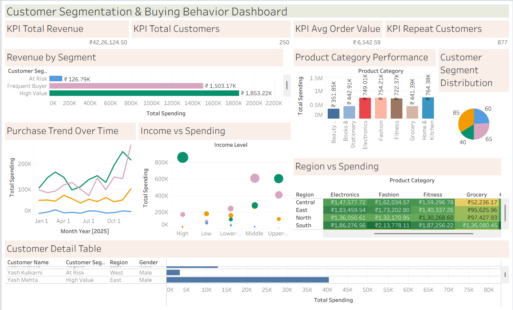

# 📊 Customer Segmentation & Buying Behavior Insights in Tableau

> **An end-to-end Tableau analytics project** analyzing customer segments, purchase behavior, regional spending, and product performance — designed to support data-driven marketing and CRM strategy.

---

## 🖼️ Dashboard Preview



---

## 🎯 Objective

To design an interactive Tableau dashboard that:
- Segments customers based on demographics and purchase patterns
- Identifies high-value customer groups
- Uncovers buying behavior trends across regions, products, and income levels
- Supports targeted marketing, retention strategy, and business decision-making

---

## 🛠️ Tools & Technologies

| Tool | Purpose |
|------|---------|
| **Tableau Desktop / Public** | Dashboard design & data visualization |
| **Microsoft Excel / CSV** | Dataset storage & preprocessing |
| **GitHub** | Version control & portfolio hosting |

---

## 📁 Project Folder Structure

```
customer-segmentation-tableau/
│
├── data/
│   └── dataset.csv
│
├── screenshots/
│   └──Chart 1.png
│   └──Chart 2.png
│   └──Chart 3.png
│   └──Chart 4.png
│   └──Chart 5.png
│   └──Chart 6.png
│   └──Chart 7.png
│   └──Dashboard.png
├── tableau/
│   └── Customer Segmentation & Buying Behavior Insights.twbx
│
└── README.md
```

---

## 📂 Dataset Description

The dataset contains **906 order-level records** across **250 unique customers**, spanning the full year 2025.

| Column | Description |
|--------|-------------|
| Customer ID / Name | Unique customer identifiers |
| Age / Age Group | Demographics |
| Gender | Male / Female |
| City / Region | 5 regions: North, South, East, West, Central |
| Occupation | Job role of customer |
| Income Level | High / Upper-Middle / Middle / Lower-Middle / Low |
| Customer Segment | High Value / Frequent Buyer / Regular / At Risk |
| Product Category | 7 categories (Fashion, Electronics, Fitness, etc.) |
| Order Date | Jan–Dec 2025 |
| Purchase Frequency | Orders per year |
| Average Order Value | Avg spend per order (₹) |
| Total Spending | Total amount spent (₹) |
| Payment Method | UPI, Credit/Debit Card, Wallet, COD, Net Banking |
| Purchase Channel | Online / App / Offline |
| Customer Loyalty Status | Platinum / Gold / Silver / Bronze |
| Discount Usage | Whether discounts were applied |
| Customer Satisfaction Score | 1–5 rating |
| Repeat Purchase Indicator | Yes / No |

---

## 📊 Dashboard Features

### KPI Cards
- **Total Revenue:** ₹42,26,124.50
- **Total Customers:** 250
- **Avg Order Value:** ₹6,542.59
- **Repeat Customers:** 877 (96.8% repeat rate)

### Visualizations
1. **Revenue by Segment** (Horizontal Bar) — High Value leads at ₹18.53L
2. **Product Category Performance** (Column Chart) — Home & Kitchen tops at ₹7.64L
3. **Purchase Trend Over Time** (Line Chart) — Month-wise spending trajectory per segment
4. **Customer Segment Distribution** (Donut Chart) — Breakdown of 4 segments
5. **Income vs Spending** (Bubble/Scatter Plot) — Correlation between income level and spend
6. **Region vs Spending** (Heatmap) — Cross-tab of region × product category spend
7. **Customer Detail Table** — Individual-level drill-down with spend bars

---

## 🔑 Tableau Concepts Used

- Calculated Fields (Total Revenue, Avg Order Value, Repeat Purchase %)
- KPI Cards using BANs (Big Ass Numbers)
- Filters & Quick Filters (Region, Segment, Category, Channel)
- Dashboard Actions (highlight/filter on click)
- Dual-axis charts
- Color-coded heatmaps
- Parameter controls
- Groups & Sets for segmentation

---

## 💡 Key Insights

1. **High Value customers (28.6% of base) drive 43.6% of total revenue** — priority segment for retention campaigns
2. **At Risk customers score 2.05/5 on satisfaction** — lowest among all segments; immediate intervention needed
3. **South region dominates spending** at ₹11.88L, followed by East (₹9.09L)
4. **Home & Kitchen and Fashion are the top-performing categories**, each crossing ₹7.5L
5. **96.8% repeat purchase rate** signals strong customer loyalty overall
6. **High-income customers spend 2.4× more than Low-income customers** on average
7. **UPI is the most popular payment method** (40.8% of transactions), followed by Debit Card
8. **Online channel leads** with 47.1% of orders; Offline is lowest at 16.8%
9. **Frequent Buyers outnumber High Value customers** but contribute ₹5L less in revenue
10. **Platinum & Gold loyalty customers are concentrated in South and East regions**

---

## 📌 Business Recommendations

- **Launch loyalty rewards** for At Risk segment to recover satisfaction scores
- **Invest in South & East region** campaigns — highest revenue density
- **Promote App channel** — currently 36.1% usage with room to grow
- **Bundle Home & Kitchen + Fashion** offers for High Value customers
- **Target Upper-Middle income** group with upsell campaigns — high conversion potential

---

## 🖥️ How to Run

1. Download the `.twbx` file from the `/tableau` folder
2. Open with **Tableau Desktop** or **Tableau Public**
3. The packaged workbook includes the dataset — no additional setup needed
4. Use the filter panel (Region / Segment / Category) to explore interactively

---


**Author:** Debarati Pal 

---

*Dataset generated using AI for educational and portfolio purposes.*
